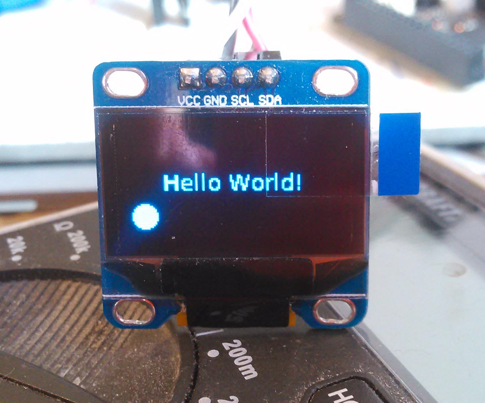
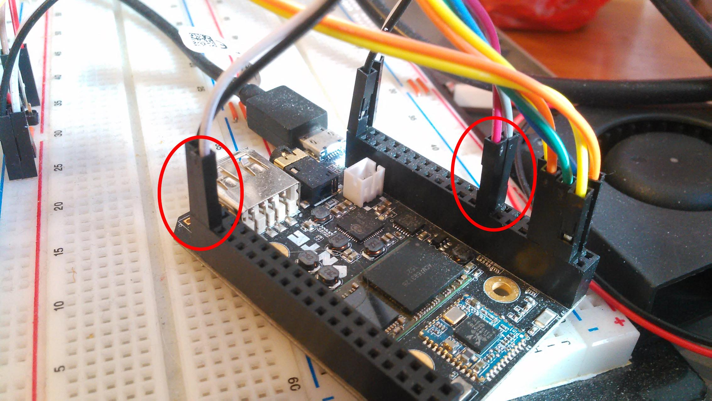

# QML OLED Renderer

Renders a QML application to a **SSD1306 OLED display**.



```qml
import QtQuick 2.6

Item {
    id: root
    visible: true
    width: 128
    height: 64

    Rectangle {
        id: indicator
        anchors.bottom: parent.bottom
        anchors.bottomMargin: 5
        x: 5
        width: 15
        height: width
        radius: width / 2
        color: "black"
    }

    Text {
        anchors.centerIn: parent
        text: "Hello World!"
    }
}
```

Tested on the [CHIP single board computer](https://getchip.com/) conected to TWI2.



## Install

Requires Qt Version 5.4 or higher. For the Debian package install this means that you need at least the packages from Debian Stretch.

```bash
sudo apt install qtdeclarative5-dev qt5-default qtchooser qtbase5-dev qml-module-qtquick2
```

Then you can install the `qml-oled-renderer` with:
```bash
qmake
make
sudo make install
```

## Usage

```
sage: qml-oled-renderer [options] source
Renders QML applications to a SSD1306 OLED display

Options:
  -h, --help               Displays this help.
  -w, --width <weight>     OLED screen width
  -b, --bus <bus>          I2C bus to which the OLED is connected
  -a, --address <address>  I2C address of the OLED screen
  -f, --fps <fps>          Number of frames to render per second

Arguments:
  source                   QML source file`
```

The OLED renderer does not work without any display device. You can easily create visual framebuffer device using `XVfb`:

```bash
sudo apt-get install xvfb
```

And the start the application as follows:
```bash
Xvfb -shmem -screen 0 128x64x16 &
DISPLAY=:0 qml-oled-renderer main.qml
```
